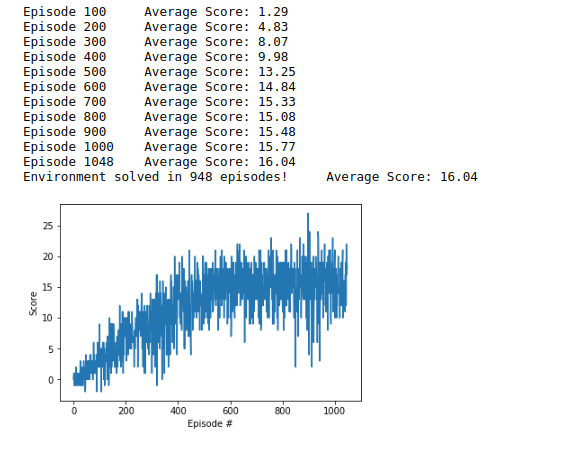

## Udacity Reinforcement Learning Nanodegree P1 - Navigation
This repo has the code for training an RL agent to navigate and collect yellow bananas in a Unity Envtt.There are 3 main files in this submission:
* Navigation.ipynb - This has the code to start the environment, train the agent and then test the trained agent
* dqn_agent.py - This file has the implementation of the DQN Agent and Replay Buffer class which is used by Navigation.ipynb
* model.py - This file has the neural network that is trained to do the funcion approximation

## About the project environment
The state space has 37 dimensions and contains the agent's velocity, along with ray-based perception of objects around agent's forward direction.  Given this information, the agent has to learn how to best select actions.  Four discrete actions are available, corresponding to:
- **`0`** - move forward.
- **`1`** - move backward.
- **`2`** - turn left.
- **`3`** - turn right.

The goal of the agent is to successfully navigate the environment and learn to pick yellow bananas while avoidinh blue bananas. The agent gets a reward of +1 for picking a yellow banana and -1 for picking a blue banana. The environment is considered solved when an agent is able to get an average score of +13 over 100 consecutive episodes.

## Setting up the Python Enviroment
The following libraries are needed to run the code:
1. unityagents - ```pip install unityagents```
To see the agent in action, please download the unity environment to your local
Download the environment from one of the links below.  You need only select the environment that matches your operating system:
    - Linux: [click here](https://s3-us-west-1.amazonaws.com/udacity-drlnd/P1/Banana/Banana_Linux.zip)
    - Mac OSX: [click here](https://s3-us-west-1.amazonaws.com/udacity-drlnd/P1/Banana/Banana.app.zip)
    - Windows (32-bit): [click here](https://s3-us-west-1.amazonaws.com/udacity-drlnd/P1/Banana/Banana_Windows_x86.zip)
    - Windows (64-bit): [click here](https://s3-us-west-1.amazonaws.com/udacity-drlnd/P1/Banana/Banana_Windows_x86_64.zip)

2. Pytorch - Install latest version based on your OS and machine from https://pytorch.org/get-started/locally/
3. Numpy, Matplotlib


## Training and Visualizing the trained agent
The code for training the agent is in the notebook Navigation.ipynb.

### Training an agent
Section 1.4 of the notebook has the code for training an agent. The command below sets up the agent for DQN.
```
from dqn_agent import Agent
agent = Agent(state_size= state_size, action_size= action_size, seed=0)
```
The function dqn() resets the environment, provides episodes to train the agent, gets actions from the agent class and passes the results of the actions (next state, reward) to the agent class.

To train the model run the cell:
```
train = True
if train:
    scores = dqn()
```

The model has been trained to get to a max reward of 16 in up to 2000 steps. The agent was able to get this score in about 1100 steps. The agent's performance is shared below:



### Visualizing the trained agent
Section 1.5 of the notebook has the code for playing in the Unity Environment with the trained agent. The main steps are:
1. Load the trained weights
```
checkpoint_name = 'checkpoint_' + str(envtt_name) +'.pth'
agent.qnetwork_local.load_state_dict(torch.load(checkpoint_name))
```

2. Play a game

```
env_info = env.reset(train_mode=False)[brain_name] # reset the environment
state = env_info.vector_observations[0]            # get the current state
score = 0                                          # initialize the score
while True:
    action = agent.act(state)  ## Take action
    env_info = env.step(action)[brain_name]        # send the action to the environment
    next_state = env_info.vector_observations[0]  # get the next state
    reward = env_info.rewards[0]                   # get the reward
    done = env_info.local_done[0]                  # see if episode has finished

    ## Add this info to our agent
    agent.step(state, action, reward, next_state, done)
    state = next_state
    score += reward
    if done:
        break
    
print("Score: {}".format(score))

```


